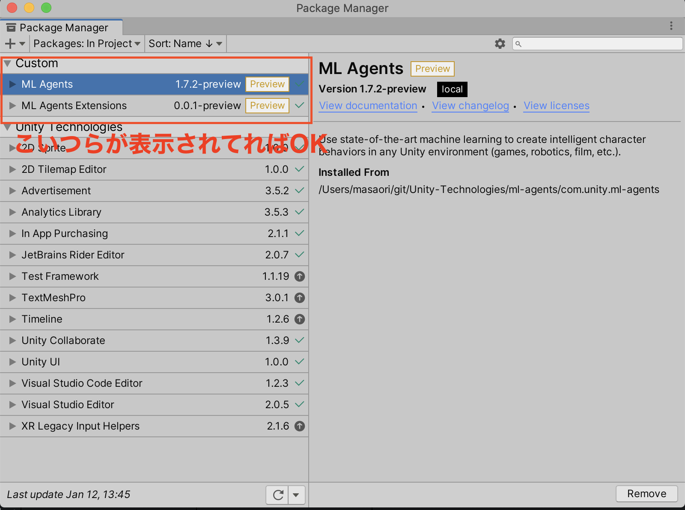
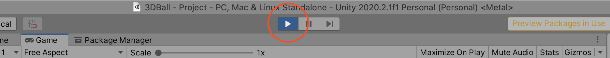

# Unity 機械学習講座 2021
- Unityを使って、機械学習(特に強化学習)を肌身で感じてもらうことがゴールです
- Unity社が公式で開発している ml-agents というオープンソースライブラリを使うので楽チンです

# セットアップ
- 初回の講座までに以下をセットアップしていただけるとスムーズです
- 英語ですが、[こちら](https://github.com/Unity-Technologies/ml-agents/tree/master/docs)に一通りのdocumentがありますので、こちらをみながらセットアップしていただいても良いです。


## 1. Unity 2020.2 のインストール
1. こちら https://unity3d.com/get-unity/download から、Unity HubをDL & インストールします
1. 以下の手順で、Unity 2020.2をインストールしてください


※Macの方は"Mac Build Support"にチェック

## 2. Unity の サンプルレポジトリをclone
- 適当なところに、ml-agentsレポジトリをcloneする
```
$ cd <ml-agentsレポジトリの置き場所>
$ git clone --branch release_12 https://github.com/Unity-Technologies/ml-agents.git
# --branch release_12 が 2021/1現在の最新のリリースブランチです
```

- Unity Hubに、以下の手順でサンプルProjectを追加してください


##### こんな画面が起動すればOK


## 3. Unity の ml-agentsパッケージのインストール
- Unity の Package Manger で ml-agentsパッケージをインストールする


##### ML Agents が Package Managerに表示されていればOK


## 4. サンプルシーンを開く


##### こんな画面が表示されればOK


## 5. python 最新版 のインストール
- [この辺り](https://www.python.jp/install/windows/virtualenv.html)や[このあたり](https://github.com/Unity-Technologies/ml-agents/blob/master/docs/Using-Virtual-Environment.md)を参考に、python の最新版(3.7以降)をインストールしてください。

※ virtualenvを使用してpythonのバージョンを管理するのがオススメです

##### pipコマンドが叩ければOK
```
$ pip3 -V # 大文字Vです
pip3 19.2.3 from /Users/hoge/python/3.7.5/lib/python3.7/site-packages/pip (python 3.7)
```

## 6. Python の mlagentsパッケージのインストール
- (Windowsのみ) pytorchのインストール
```
pip3 install torch==1.7.0 -f https://download.pytorch.org/whl/torch_stable.html
```
> Note that on Windows, you may also need Microsoft's Visual C++ Redistributable if you don't have it already. See the PyTorch installation guide for more installation options and versions.

とあるので、[こちら](https://pytorch.org/get-started/locally/#windows-prerequisites)を参考にPyTorchのインストールを頑張ってください。

- mlagentsのインストール
```
pip3 install mlagents
```

##### mlagents-learn コマンドが叩ければOK
```
mlagents-learn --help
```

## 7. 動作確認
### Python mlagents-learnが起動していない状態での確認

先ほど、4．の手順で、Unity側で開いた以下の画面を表示


Playボタンをおす


consoleを確認


↑のメッセージが表示されていたら正常

かつ、青い子たちがこんな動きをします


一回止めましょう


### Python mlagents-learnの起動している状態での確認

ターミナルで
```
$ cd <ml-agentsレポジトリのpath>
$ mlagents-learn config/ppo/3DBall.yaml --run-id=first3DBallRun


                        ▄▄▄▓▓▓▓
                   ╓▓▓▓▓▓▓█▓▓▓▓▓
              ,▄▄▄m▀▀▀'  ,▓▓▓▀▓▓▄                           ▓▓▓  ▓▓▌
            ▄▓▓▓▀'      ▄▓▓▀  ▓▓▓      ▄▄     ▄▄ ,▄▄ ▄▄▄▄   ,▄▄ ▄▓▓▌▄ ▄▄▄    ,▄▄
          ▄▓▓▓▀        ▄▓▓▀   ▐▓▓▌     ▓▓▌   ▐▓▓ ▐▓▓▓▀▀▀▓▓▌ ▓▓▓ ▀▓▓▌▀ ^▓▓▌  ╒▓▓▌
        ▄▓▓▓▓▓▄▄▄▄▄▄▄▄▓▓▓      ▓▀      ▓▓▌   ▐▓▓ ▐▓▓    ▓▓▓ ▓▓▓  ▓▓▌   ▐▓▓▄ ▓▓▌
        ▀▓▓▓▓▀▀▀▀▀▀▀▀▀▀▓▓▄     ▓▓      ▓▓▌   ▐▓▓ ▐▓▓    ▓▓▓ ▓▓▓  ▓▓▌    ▐▓▓▐▓▓
          ^█▓▓▓        ▀▓▓▄   ▐▓▓▌     ▓▓▓▓▄▓▓▓▓ ▐▓▓    ▓▓▓ ▓▓▓  ▓▓▓▄    ▓▓▓▓`
            '▀▓▓▓▄      ^▓▓▓  ▓▓▓       └▀▀▀▀ ▀▀ ^▀▀    `▀▀ `▀▀   '▀▀    ▐▓▓▌
               ▀▀▀▀▓▄▄▄   ▓▓▓▓▓▓,                                      ▓▓▓▓▀
                   `▀█▓▓▓▓▓▓▓▓▓▌
                        ¬`▀▀▀█▓

        
 Version information:
  ml-agents: 0.23.0,
  ml-agents-envs: 0.23.0,
  Communicator API: 1.3.0,
  PyTorch: 1.7.1
2021-01-19 13:10:16 INFO [learn.py:275] run_seed set to 2906
2021-01-19 13:10:16 INFO [environment.py:205] Listening on port 5004. Start training by pressing the Play button in the Unity Editor.
```
※ 起動に結構時間かかるので注意

先ほど、と同様に、Unity側でPlayボタンを押す


なにも出てなければ正常

かつ、青い子たちの動きがさっきより激しいはず


止める


ターミナルに以下のような表示が出ていたら正常
```
2021-01-19 13:18:44 INFO [environment.py:111] Connected to Unity environment with package version 1.7.2-preview and communication version 1.3.0
2021-01-19 13:18:44 INFO [environment.py:271] Connected new brain:
3DBall?team=0
2021-01-19 13:18:44 INFO [stats.py:147] Hyperparameters for behavior name 3DBall: 
	trainer_type:	ppo
	hyperparameters:	
	  batch_size:	64
    (中略)
	self_play:	None
	behavioral_cloning:	None
	framework:	pytorch
2021-01-19 13:18:53 INFO [stats.py:139] 3DBall. Step: 12000. Time Elapsed: 18.819 s. Mean Reward: 1.139. Std of Reward: 0.710. Training.
2021-01-19 13:18:56 INFO [subprocess_env_manager.py:186] UnityEnvironment worker 0: environment stopping.
2021-01-19 13:18:56 INFO [trainer_controller.py:189] Learning was interrupted. Please wait while the graph is generated.
2021-01-19 13:18:56 INFO [model_serialization.py:104] Converting to results/first3DBallRun/3DBall/3DBall-12447.onnx
2021-01-19 13:18:56 INFO [model_serialization.py:116] Exported results/first3DBallRun/3DBall/3DBall-12447.onnx
2021-01-19 13:18:56 INFO [torch_model_saver.py:116] Copied results/first3DBallRun/3DBall/3DBall-12447.onnx to results/first3DBallRun/3DBall.onnx.
2021-01-19 13:18:56 INFO [trainer_controller.py:85] Saved Model
$ 
```

以上で動作確認は終わりです！

講義をお楽しみに！
